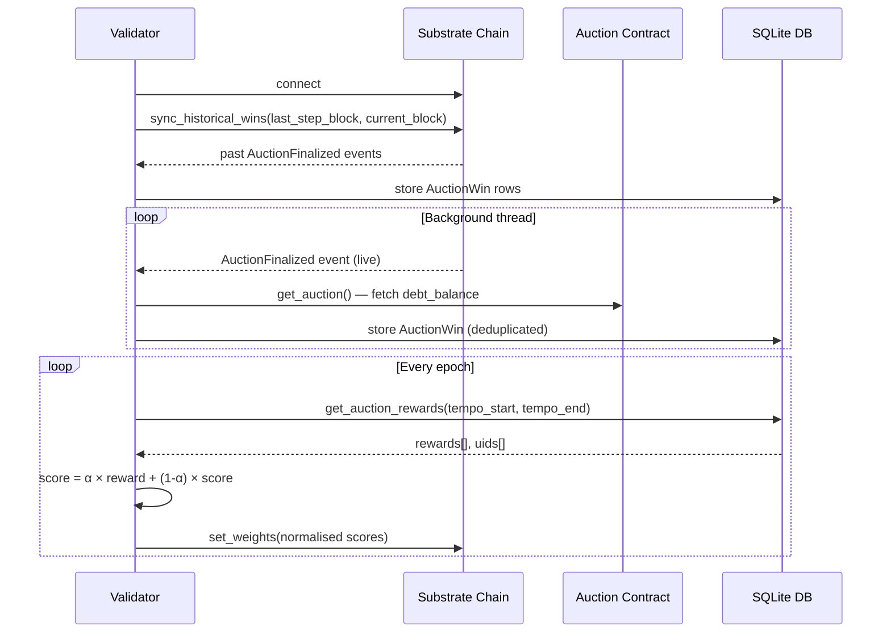

# Validator

## What Validators Do

Validators observe the TensorUSD auction contract on-chain, track which miners win liquidation auctions, and use those results to assign weights to miners on the Bittensor network. Those weights determine each miner's share of TAO emissions each epoch.

---

## How Validators Score Miners

Every `AuctionFinalized` event is recorded. At the end of each epoch, the validator scores every miner's wins using this formula:

```
bonus_ratio = min((winning_bid - debt_balance) / debt_balance, 0.20)

reward = 1.0 + bonus_ratio
```

| Winning Bid vs Debt | `bonus_ratio` | `reward` |
|---|---|---|
| Exactly debt (`bid = debt`) | `0.00` | `1.0` |
| 10% over debt | `0.10` | `1.1` |
| 20%+ over debt (capped) | `0.20` | `1.2` |

- Minimum reward per win: **1.0**
- Maximum reward per win: **1.2**
- Multiple wins in the same epoch accumulate:

```
total_reward(miner) = sum of reward(win_i) for all wins in tempo window
```

---

## Weight Setting

Scores are smoothed over time using an exponential moving average (EMA), then submitted to the chain as weights:

```
score = α × new_reward + (1 - α) × previous_score

weights = L1_normalise(scores)   →   submitted via subtensor.set_weights()
```

Each miner's TAO emission share is proportional to their normalised weight. Miners that haven't won any auction in the epoch get no weight increase — their score decays toward zero via the EMA.

---

## How to Run

```bash
uv run neurons/validator.py \
  --netuid 421 \
  --subtensor.network test \
  --wallet.name <wallet_coldkey> \
  --wallet.hotkey <wallet_hotkey> \
  --logging.info
```

| Flag | Description |
|---|---|
| `--netuid 421` | Subnet UID to validate on |
| `--subtensor.network test` | Connect to the testnet |
| `--wallet.name test` | Name of the local wallet |
| `--wallet.hotkey default` | Hotkey to use for this validator |
| `--logging.info` | Enable info-level logs |

---

## Sequence Diagram


